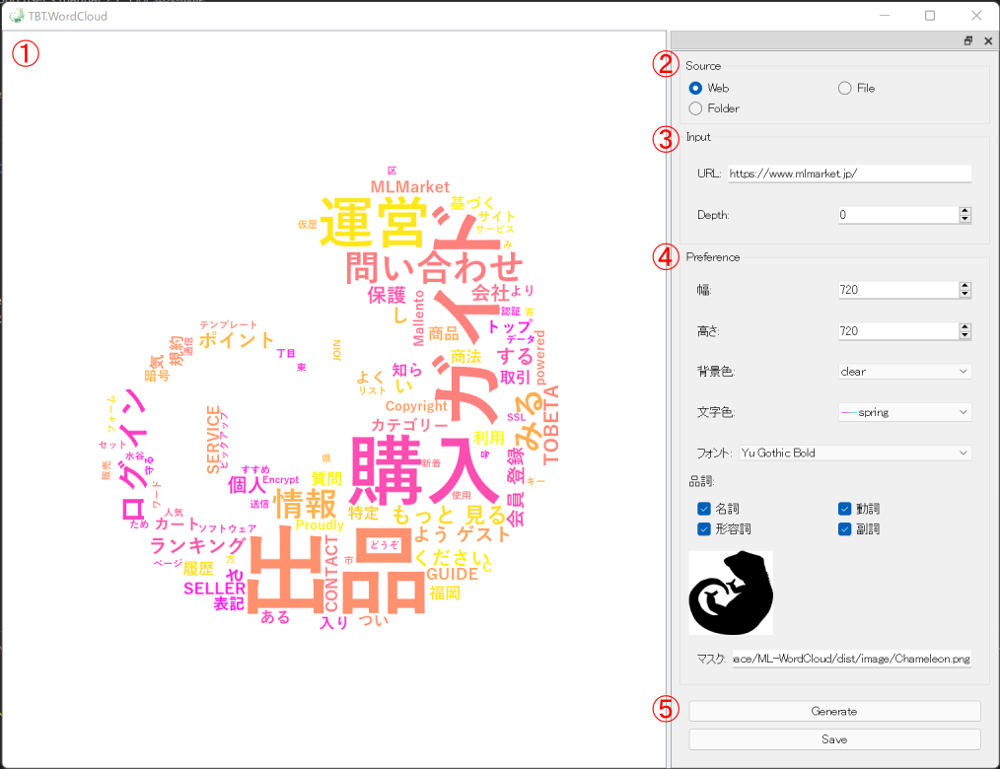

# TBT.WordCloud user's manual

<br>
<br>

# クイックスタート
1. ①でWebを選択
2. ②でURLを指定 ※https://news.yahoo.co.jp/など
3. ⑤でGenerate
<br>
<br>

# 概説

<br>

### ① 生成されたワードクラウド画像の確認エリア
### ② もととなるテキストの入力方法選択
### ③ 入力の設定（URLやPath, Depthなど）
* 入力方法にWebやFolderを選択した場合、深さ(Depth)が指定できます
* Pathなどのテキスト入力欄は、ダブルクリックでファイル選択ダイアログなどが起動します
* Web入力 & Depth = 0のとき、指定されたURL(html)のみ含まれる文字を参照します
* Web入力 & Depth = 1のとき、指定されたURL(html)に含まれる文字と、htmlに含まれるリンク先ページ(html)に含まれる文字とを参照します
* Depthが1以上の時も、指定されたURLのドメイン以外のページは参照しません
    ```
    https://yahoo.co.jp/main/index.html ※対象（指定されたURL）
    ├─ https://yahoo.co.jp/main/page1.html ※対象
    ├─ https://yahoo.co.jp/main/sample/page2.html ※対象
    └─ https://yahoo.co.jp/page3.html ※対象
    └─ https://google.com/page4.html ※非対象（リンクが含まれていたとしても参照しない）
    ```
* Folder入力 & Depth = 0のとき、指定されたフォルダ直下に含まれる読み込み可能なファイルをすべて参照します
* Folder入力 & Depth = 1のとき、指定されたフォルダ直下および子フォルダに含まれる読み込み可能なファイルをすべて参照します
### ④ ワードクラウド画像の設定
* 画像サイズ、背景色、文字色、フォント、マスクなどが指定できます
* マスクはマスク画像の黒色のエリアにワードクラウドが埋め込まれます
### ⑤ ワードクラウドの生成、保存
<br>
<br>

# 実行ファイルテスト環境
* Windows 11 Enterprise Ver.21H2
* Windows 10 Home Ver.21H2
<br>
<br>

# 質問・お問い合わせ
URL(質問issue投稿OK): https://github.com/MasakazuTobeta/TBT.WordCloud/issues
<br>
Mail: m.tobeta@tobeta.jp
<br>
<br>

# Appendix
## GPL・LGPLが適用されるソフトウェアの利用について
本ソフトウェアには、GNU General Public License (GPL)またはGNU Lesser General Public License (LGPL)に基づきライセンスされるソフトウェアが含まれています。
お客様は、当該ソフトウェアのソースコードを入手し、GPLまたはLGPLに従い、複製、頒布及び改変することができます。
ソースコードは現状のまま、かつGPL/LGPLに基づき提供されます。<br>
GPLについてはこちらのURLでご確認ください。　http://www.gnu.org/licenses/gpl.html<br>
LGPLについてはこちらのURLでご確認ください。　http://www.gnu.org/licenses/lgpl.html<br>
本ソフトウェアソースコードについてはこちらのURLでご確認ください。https://github.com/MasakazuTobeta/TBT.WordCloud<br>